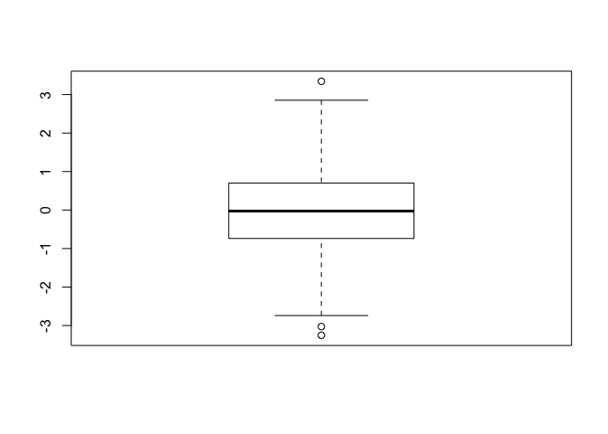
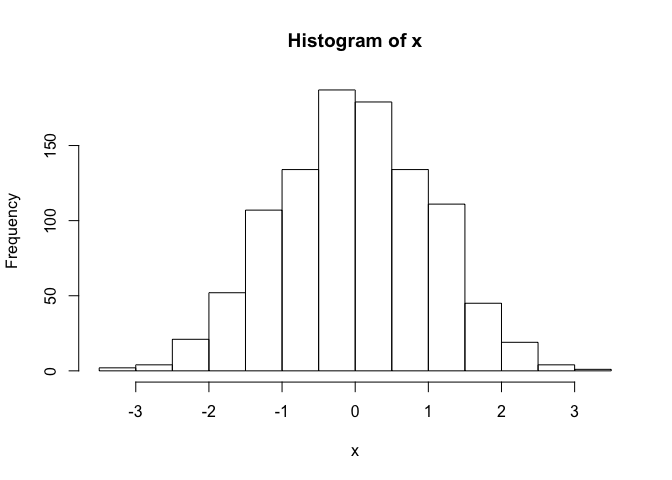
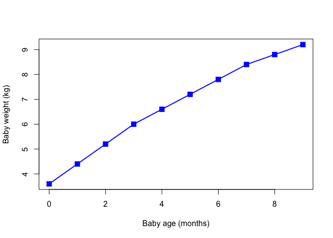
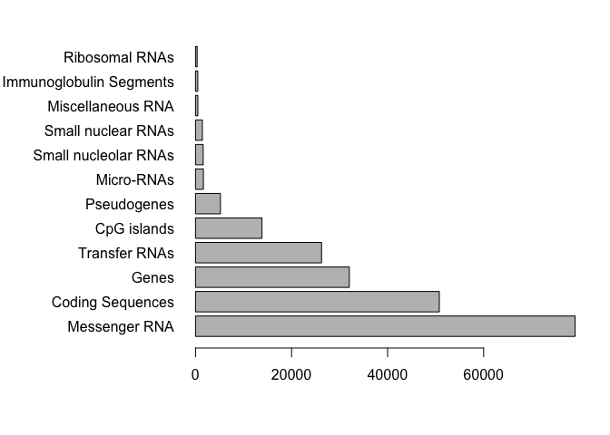

Class5: Data exploration and visualization in R
================
Barry Grant
2019-10-31

``` r
# Class5 Data visualization
x <- rnorm(1000)

# some summary stats
mean(x)
```

    ## [1] -0.01784964

``` r
sd(x)
```

    ## [1] 1.036325

``` r
summary(x)
```

    ##     Min.  1st Qu.   Median     Mean  3rd Qu.     Max. 
    ## -3.25433 -0.73836 -0.02576 -0.01785  0.70212  3.34428

``` r
boxplot(x)
```

<!-- -->

``` r
hist(x)
```

<!-- -->

``` r
# Section 2 scaterplots
# lets read our input file first

baby <- read.table("bimm143_05_rstats/weight_chart.txt",
                   header = TRUE)

plot(baby$Age, baby$Weight,typ="o", cex=1.5, pch=15, 
     col="blue", lwd=2, xlab="Baby age (months)",
     ylab="Baby weight (kg)")
```

<!-- -->

``` r
##
#read.table(", 
feat <- read.table("bimm143_05_rstats/feature_counts.txt", 
           sep="\t", header=TRUE)

mouse <- read.delim("bimm143_05_rstats/feature_counts.txt")

par(mar=c(5,11,2,2) )
barplot(mouse$Count, names.arg = mouse$Feature, 
        horiz = TRUE, las=1)
```

<!-- -->
